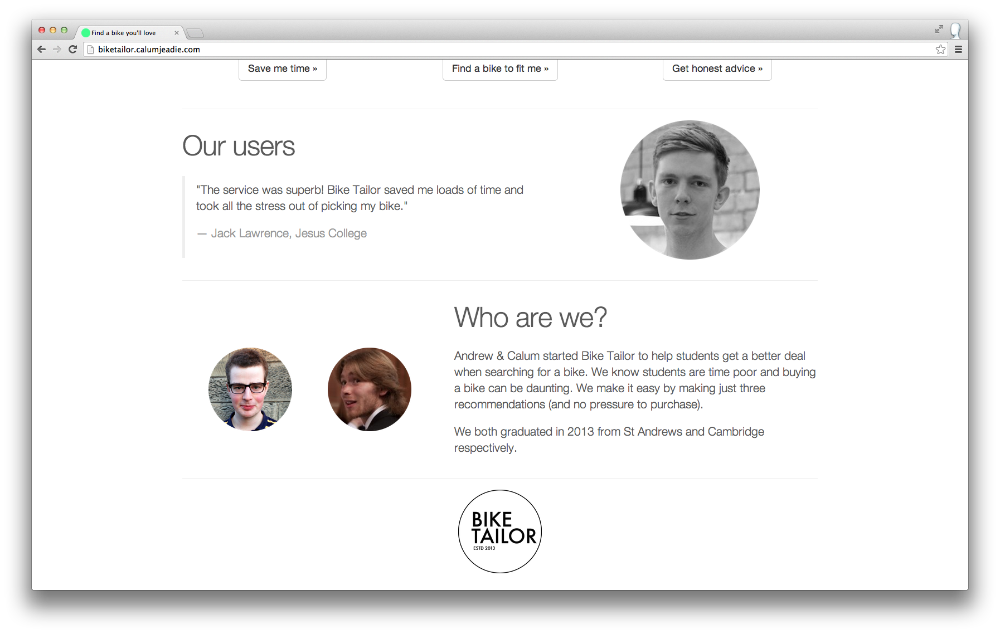

Bike Tailor
===========

A prototype for exploring buying decisions.

Screenshots
-----------





Made with
---------

- Django
- Vagrant
- Heroku
- Bootstrap
- Google Forms

---

Local Development
-----------------

### Setup

Clone the repository.

```sh
git clone git@github.com:CalumJEadie/biketailor.git
cd biketailor
```

Boot up a local Virtual Machine using Vagrant.

```sh
vagrant up
```

SSH into machine and install.

```sh
# On host machine.
vagrant ssh
# On guest machine.
cd /vagrant
virtualenv venv
source venv/bin/activate
pip install -r requirements.txt
```

### Usage

```sh
# On host machine.
vagrant up
vagrant ssh
# On guest machine.
cd /vagrant
source venv/bin/activate
python manage.py runserver 0.0.0.0:8000
```

View at http://127.0.0.1:8000.